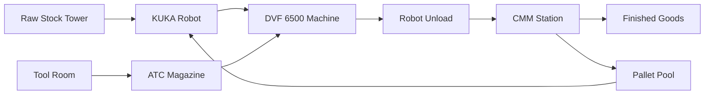
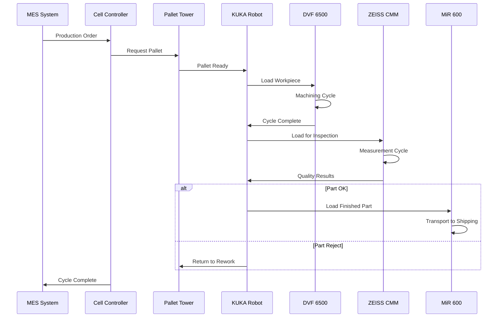

# Hyperion Manufacturing — Lights-Out Cell v0.1

**Proof-of-concept fully-automated machining cell** featuring DVF 6500 + KUKA + Fastems-style material tower + robot-loaded CMM + tool-room automation.

## Material Flow



## Repository Structure

- `docs/` - High-level narrative and design documents
- `research/` - Vendor PDFs, specifications, price quotes
- `layout/` - CAD files and 2D SVG/PNG exports
- `bom/` - Bill of materials YAML and cost models
- `integration/` - OPC-UA, REST, ROS interface documentation

## Current Status


✅ **Sprint 1 — Execution Complete** (90% BOM coverage achieved)

See [Project Board](../../projects) and [Issues](../../issues) for current tasks and progress.

## Quick Start

1. Review the [vision document](docs/vision.md)
2. Check current [bill of materials](bom/bom.yaml)
3. Browse [research findings](research/)
4. View [cell layout](layout/cell-v0.svg)

## Production Sequence



## How to Contribute

### For Researchers
1. **Fork** the repository and create a feature branch
2. **Research** components using the templates in `docs/templates/`
3. **Document** findings in appropriate `research/` subdirectories
4. **Update** the BOM in `bom/bom.yaml` with validated information
5. **Submit** a pull request with clear commit messages using `type(scope): message` format

### For Engineers
1. **Review** existing research and identify gaps using GitHub Issues
2. **Validate** technical specifications through vendor contact
3. **Create** detailed integration requirements in `integration/`
4. **Update** layout drawings in `layout/` directory
5. **Test** CI pipeline locally before submitting changes

### Commit Message Convention
```
type(scope): brief description

Detailed explanation of changes made, why they were made,
and any additional context needed.

Fixes #123
```

**Types**: `research`, `layout`, `integration`, `bom`, `docs`, `ci`, `fix`
**Scopes**: `machine`, `robot`, `pallet`, `quality`, `tooling`, `safety`, `amr`, `controls`

### Issue Templates
Use the provided GitHub issue templates for:
- **Gap Analysis**: Track missing information or unresolved questions
- **Research Tasks**: Document specific vendor and component research

## License

MIT License - See [LICENSE](LICENSE) 
