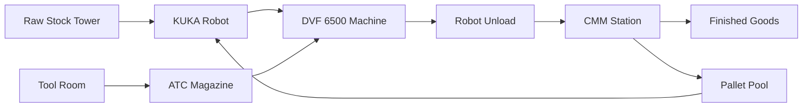

# Hyperion Manufacturing — Lights-Out Cell v0.1

**Proof-of-concept fully-automated machining cell** featuring DVF 6500 + KUKA + Fastems-style material tower + robot-loaded CMM + tool-room automation.

## Material Flow

## Repository Structure

- `docs/` - High-level narrative and design documents
- `research/` - Vendor PDFs, specifications, price quotes
- `layout/` - CAD files and 2D SVG/PNG exports
- `bom/` - Bill of materials YAML and cost models
- `integration/` - OPC-UA, REST, ROS interface documentation

## Current Status

🚧 **Sprint 0 — Discovery Phase**

See [Issues](../../issues) for current research gaps and tasks.

## Quick Start

1. Review the [vision document](docs/vision.md)
2. Check current [bill of materials](bom/bom.yaml)
3. Browse [research findings](research/)
4. View [cell layout](layout/cell-v0.svg)

## License

MIT License - See [LICENSE](LICENSE) 
