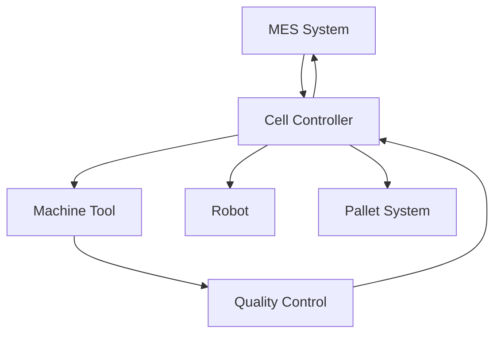
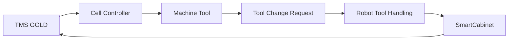

# Hyperion Lights-Out Cell — Controls Overview

## System Architecture

### Control Hierarchy
```
Level 4: MES/ERP Integration
    ↓ OPC-UA, REST APIs
Level 3: Cell Controller (Siemens S7-1500F)
    ↓ PROFINET, EtherNet/IP
Level 2: Machine Controllers
    ↓ I/O, Fieldbus
Level 1: Field Devices
```

### Network Infrastructure

#### Primary Networks
| Network | Protocol | Purpose | Speed |
|---------|----------|---------|-------|
| Plant Ethernet | TCP/IP | MES integration, HMI | 1 Gbps |
| Control Network | PROFINET | Real-time control | 100 Mbps |
| Safety Network | PROFIsafe | Safety functions | 100 Mbps |
| Industrial WiFi | 802.11ac | AMR communication | 300 Mbps |

#### IP Address Plan
```
10.1.10.0/24 - Plant Network (MES, servers, HMI)
10.1.20.0/24 - Control Network (PLCs, drives, I/O)
10.1.30.0/24 - Safety Network (safety controllers, devices)
10.1.40.0/24 - WiFi Network (AMRs, mobile devices)
```

## Component Integration

### Primary Machine Tool: DN Solutions DVF 6500
- **Control**: CUFOS CNC with Siemens 840D sol
- **Interface**: OPC-UA server (port 4840)
- **Data Points**: 
  - Machine status, program status, spindle load
  - Tool life data, part count, alarm status
  - Coordinate data, feed/speed overrides
- **I/O**: 24V digital I/O for start/stop/reset signals
- **Safety**: Category 3 safety circuits integrated

### Material Handling: KUKA KR 210 R3100 ultra
- **Control**: KRC5 controller with KUKA.PLC mxAutomation
- **Interface**: PROFINET with ProfiSafe
- **Programming**: WorkVisual + KUKA.Sim for offline programming
- **Safety**: PLd integrated safety functions
- **I/O**: 64 safe + 256 standard I/O channels

### Pallet System: Fastems FPT-630
- **Control**: MMS Manufacturing Management Software
- **Interface**: OPC-UA server + PROFINET I/O
- **Data Exchange**: Pallet location, status, part data
- **Integration**: Direct interface to KUKA robot controller
- **Safety**: Light curtain integration for access control

### Quality Control: ZEISS PRISMO Navigator
- **Control**: ZEISS CALYPSO measurement software
- **Interface**: OPC-UA + Ethernet TCP/IP
- **Automation**: Multi-Load system for robot interface
- **Data**: Measurement results, SPC data, part status
- **Integration**: Direct feedback to cell controller

### Tool Management: Zoller SmartCabinet + TMS
- **Control**: TMS GOLD software suite
- **Interface**: OPC-UA + REST API
- **Data Exchange**: Tool requests, inventory status, lifecycle data
- **Integration**: Direct interface to DVF 6500 tool magazine
- **RFID**: Tool tracking throughout cell

### AMR: MiR 600 with ShelfLift
- **Control**: MiR Fleet Enterprise software
- **Interface**: REST API → OPC-UA gateway
- **Navigation**: Infrastructure-free SLAM
- **Integration**: Material flow coordination with cell controller
- **Safety**: Speed separation monitoring with SICK scanners

### Safety System: SICK Complete Solution
- **Controller**: Flexi Soft modular safety controller
- **Network**: PROFIsafe integration with S7-1500F
- **Devices**: microScan3 scanners, C4000 light curtains
- **Functions**: Area protection, speed monitoring, emergency stop

## Cell Controller: Siemens S7-1500F

### Hardware Configuration
- **CPU**: 1515F-2 PN with integrated safety functions
- **I/O**: ET 200SP distributed I/O stations
- **Safety**: F-modules for safety I/O integration
- **Communication**: PROFINET, EtherNet/IP, OPC-UA

### Software Architecture
```
TIA Portal V17 Project Structure:
├── Safety Program (F-CPU)
│   ├── Emergency stop logic
│   ├── Area protection zones  
│   ├── Robot safety monitoring
│   └── Machine safety circuits
├── Control Program (Standard CPU)
│   ├── Production sequencing
│   ├── Material flow control
│   ├── Quality data handling
│   └── Tool management
└── HMI Application
    ├── Production overview
    ├── Manual operations
    ├── Diagnostics
    └── Recipe management
```

### OPC-UA Server Configuration
- **Namespace**: urn:hyperion:lights-out-cell
- **Security**: Basic256Sha256 with certificates
- **Data Model**: Companion specifications where available
- **Clients**: MES system, HMI stations, data historians

## Data Flow Architecture

### Production Data


### Tool Management Data Flow


## Integration Points

### Critical Interfaces
1. **KUKA ↔ DVF 6500**: Pallet loading/unloading handshake
2. **KUKA ↔ PRISMO**: Part positioning and measurement triggers
3. **KUKA ↔ Fastems**: Pallet exchange protocols
4. **Cell Controller ↔ All Systems**: Production orchestration
5. **Safety System ↔ All Motion**: Emergency stop propagation

### Communication Protocols
- **OPC-UA**: Primary data exchange protocol
- **PROFINET**: Real-time control network
- **PROFIsafe**: Safety-related communication
- **REST API**: AMR and tool management integration
- **TCP/IP**: Standard Ethernet communication

## Safety Integration

### Safety Functions
- **Emergency Stop**: Category 1 across all systems
- **Area Protection**: PLd laser scanners with speed monitoring
- **Door Monitoring**: Light curtains with muting for material flow
- **Robot Safety**: Speed and separation monitoring per ISO TS15066
- **Machine Safety**: Category 3 circuits with monitoring

### Safety Logic
```
Safety Controller Network:
├── Master: Siemens S7-1500F
├── Slaves: SICK Flexi Soft controllers
├── I/O: F-modules for safety devices
└── Communication: PROFIsafe network
```

### Risk Assessment
- **Overall Performance Level**: PLd (ISO 13849-1)
- **Probability of Failure**: 10^-7 to 10^-6 per hour
- **Safety Integrity Level**: SIL 2 (IEC 62061)

## Startup and Commissioning

### Phase 1: Infrastructure
1. Network installation and testing
2. PLC hardware installation and wiring
3. Safety system commissioning and validation
4. Basic communication testing

### Phase 2: Equipment Integration
1. Individual machine integration and testing
2. Robot programming and safety validation
3. Pallet system integration and material flow
4. Tool management system commissioning

### Phase 3: System Integration
1. Cell controller program development
2. Production sequence programming
3. HMI development and testing
4. MES integration and data validation

### Phase 4: Production Validation
1. Dry run testing without parts
2. First article production runs
3. Lights-out validation testing
4. Performance optimization

## Maintenance and Support

### Remote Monitoring
- **VPN Access**: Secure remote connectivity for vendors
- **Data Historians**: Trend analysis and predictive maintenance
- **Alarm Management**: Centralized alarm handling and escalation
- **Performance Metrics**: OEE tracking and reporting

### Backup and Recovery
- **PLC Programs**: Automatic backup to secure servers
- **HMI Applications**: Version control and change management
- **Configuration Data**: Machine parameters and recipes
- **Documentation**: Technical drawings and manuals

### Vendor Support Contracts
- **Siemens**: 24/7 support for PLC and safety systems
- **KUKA**: Robot maintenance and software updates
- **ZEISS**: CMM calibration and software support
- **Fastems**: MMS software and mechanical maintenance